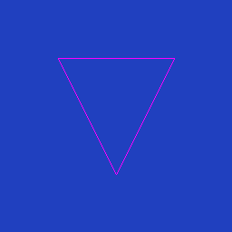

# VkSWR

Vulkan ICD written in Rust.

The current goal is to fully implement the Vulkan Core 1.0 API with a software renderer.

## Goals
- [x] vulkaninfo
- [ ] vkcube
  - [x] Entry points.
  - [ ] Rendering.
  - [x] Presentation.
- [ ] dEQP-VK tests
  - [ ] dEQP-VK.api.*
    - [x] dEQP-VK.api.info.*
    - [ ] dEQP-VK.api.smoke.triangle
      - [ ] Rendering.

        
    - [x] dEQP-VK.api.object_management.single.buffer_view_uniform_r8g8b8a8_unorm
  - [ ] dEQP-VK.memory.*
    - [x] dEQP-VK.memory.requirements.*
    - [x] dEQP-VK.memory.pipeline_barrier.host_write_vertex_buffer.1024_vertex_buffer_stride_2
    - [x] dEQP-VK.memory.pipeline_barrier.host_write_vertex_buffer.1024_vertex_buffer_stride_4
    - [x] dEQP-VK.memory.pipeline_barrier.host_write_vertex_buffer.8192_vertex_buffer_stride_2
    - [x] dEQP-VK.memory.pipeline_barrier.host_write_index_buffer.1024
